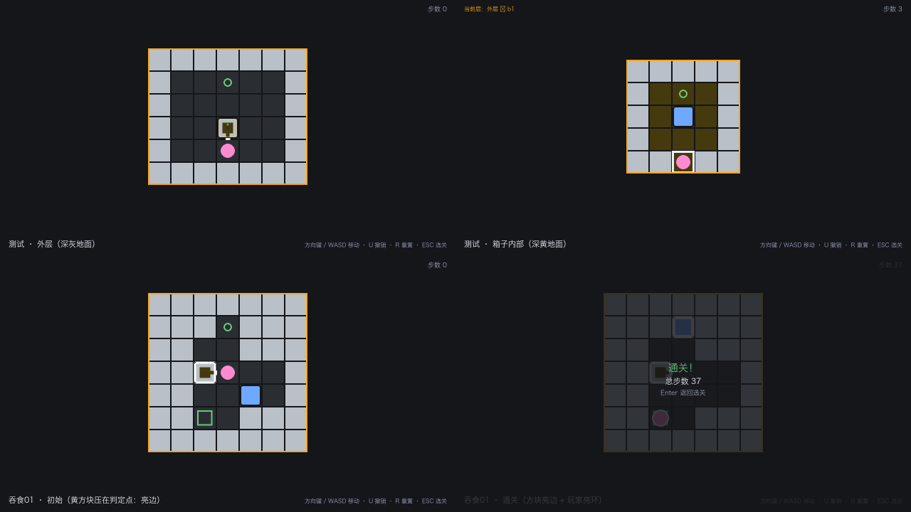

# 递归之箱 · Parabox

Python + Pygame 复刻《Patrick's Parabox》的**单关卡**玩法：推箱子、箱子内部是另一个世界、箱子可以进出彼此的内部空间。



> 左上：外层（淡灰墙 / 深灰地面，洋红玩家、黄蓝方块）· 右上：进入箱子内部（地面变深黄）
> 左下：`吞食01` 初始（黄方块压在判定点上，描边发亮）· 右下：通关瞬间（方块亮边 + 玩家亮环）

---

## 操作

| 按键 | 作用 |
|---|---|
| `↑` `↓` `←` `→` 或 `W` `A` `S` `D` | 移动 / 推箱子（站在箱子口的那一侧、箱子推不动时按方向键 = 进入箱子） |
| `U` | 撤销一步 |
| `R` | 重置本关 |
| `ESC` | 返回选关（在选关界面按 = 退出游戏） |
| `Enter` | 选关界面开始游戏 / 通关后返回选关 |

## 关卡

| 关卡 | 规模 | 最短步数 | 演示的机制 |
|---|---|---|---|
| **测试**（`levels/level_01.json`） | 外层 7×6 + 内层 5×5 | 5 步 | 推箱子、进入箱子内部、在内层把箱子推上目标点 |
| **吞食01**（`levels/level_02.json`） | 外层 7×7 + 内层 5×5 | 37 步 | 把箱子**吞进**另一个箱子的口里，再进箱子把它**推出来**；箱子自身压在判定点上 |

<details>
<summary>点开看解法（剧透）</summary>

- **测试**：`上 上 上 上 上`（前两步把箱子推上外层目标点，第三步从口钻进箱子，后两步在内层把箱子推到位）
- **吞食01**：最短 37 步，关键在第 9 步把箱子推进 A 的右侧口（**吞食**），约第 22 步从内部把箱子推出来，最后把箱子推上 `(3,1)`、玩家站到 `(2,5)` 的 `G` 上

两关的解法都写成了测试（`tests/test_logic.py::TestWinAndLevel`），关卡被改到无解会立刻报红。
</details>

## 核心机制

- **推箱子与箱子链**：推动方向上连续相邻的箱子整条链同时移动一格；链尾前方是墙则整条链不动。
- **吸入**：被推的箱子推不动时，如果它的**口正好朝着推动方向**、口上又顶着推不开的箱子，后者会被吸进它的内部世界。
- **口由内层地图决定**：内层世界宽高必须是奇数，四条边的**中心格**就是口位——中心格是墙 → 这条边进不去也出不来；边缘除中心格外必须都是墙。
- **双向穿口**：外层的箱子可以被推进别人朝向它的口；内层的箱子站在口格上再推一步，就能被推出到外层（与玩家用同一个口、同一个落点）。
- **跨层冻结**：进入内层后外层完全冻结，不响应输入、也不自行更新（不存在"内层动作带动外层"的镜像同步）。
- **判定点**：`g` = 箱子判定点（方框，被箱子盖住即达成），`G` = 玩家判定点（圆环，玩家站上去即达成，整关最多一个）；达成时描边 / 外圈发亮。
- **嵌套不限层数**：任意深度的箱子套箱子都合法，唯一的硬校验是**自引用**（箱子不能直接或间接装自己）。

机制细节的权威定义在 `.dsh/skills/*/SKILL.md`，代码与文档由测试守着一致性。

## 关卡数据格式

关卡是纯 JSON，放在 `levels/` 下，**新增关卡只加文件、不改代码**：

```json
{
  "name": "level_01",
  "title": "测试",
  "hint": "一句话提示",
  "world": {
    "w": 7, "h": 6,
    "tiles": ["#######", "#..g..#", "#.....#", "#.....#", "#..P..#", "#######"],
    "boxes": [
      { "uid": "b1", "at": [3, 3],
        "inner_world": { "w": 5, "h": 5, "tiles": ["#####", "#.g.#", "#...#", "#...#", "##.##"], "boxes": [] } }
    ]
  }
}
```

地形字符：`#` 墙、`.` 空地、`g` 箱子判定点、`G` 玩家判定点、`P` 玩家起点。
字段含义与全部校验规则见 [`.dsh/skills/level-loading/SKILL.md`](.dsh/skills/level-loading/SKILL.md)。

## 项目结构

```
parabox/
├── main.py               # 入口
├── src/
│   ├── game.py           # 主循环、状态机（menu / play / win）
│   ├── world.py          # 世界/关卡数据结构、解析校验、目标点统计
│   ├── entity.py         # 玩家、箱子、箱子链、口（door）判定
│   ├── logic.py          # 推箱、链推动、吸入调度、穿口、胜利判定
│   ├── nested.py         # 进入/退出内层、搬运、自引用校验
│   ├── render.py         # Pygame 绘制（多层世界 + 箱内缩略图 + HUD）
│   └── ui.py             # 选关界面
├── levels/               # 关卡数据（level_01「测试」、level_02「吞食01」）
├── tests/                # unittest：108 个用例
├── assets/               # logo、favicon、关卡格式示例图
├── screenshots/          # 美术预览图
├── AGENTS.md             # 项目约定：结构、核心机制、代码与分层规则
├── RULE.md               # 行为准则：修改前确认、代码质量、交付检查
└── .dsh/skills/          # 机制技能（推箱 / 嵌套世界 / 渲染 / 关卡加载）
```

### 规则体系（本项目的工程重点）

机制不写在代码注释里，而是沉淀成三份互相约束的文档：

- **`AGENTS.md`** —— 项目长什么样：目录结构、核心机制规则、分层依赖、命名与测试要求
- **`RULE.md`** —— 该怎么干活：通用行为准则、修改前必须确认的事项、代码质量约束、交付检查
- **`.dsh/skills/*/SKILL.md`** —— 每个机制的精确定义（推箱子逻辑、嵌套世界、渲染规范、关卡格式）

文档和实现由测试守护：渲染色板必须与技能文档逐值一致、配色必须满足对比度阈值。

## 测试

```
121 个用例，覆盖：
- 规则逻辑（41）  ：推箱、链推动、吸入、进出内层、双向穿口、自引用、胜利判定、两关的通关解法
- 数据结构（44）  ：关卡解析与非法数据、口规则、嵌套校验、目标点统计
- 渲染交互（23）  ：色板与文档一致性、对比度、缩略图几何、绘制只读状态、选关与主循环
- 打包与自检（13）：源码/打包两种运行位置下的关卡目录解析、自检报告与失败路径
```

```bash
.venv/bin/python -m unittest discover tests -v
```

## 打包成 exe（投屏 / 拷到别的电脑）

在自己的 Windows 电脑上：双击 **`build_windows.bat`**，产物是 `dist\RecursiveBox.exe`，
双击即玩，不需要装 Python。投屏前先自检一次：

```bash
RecursiveBox.exe --selftest    # 退出码 0 = 通过，同目录生成 selftest_report.txt
```

完整步骤（含云端构建备份方案、SmartScreen 提示、分辨率注意事项）见 **`PACKAGING.md`**。

## 已知限制

- 未实现音效与通关计时（`RULE.md` 中列为选做）。
- 没有死局提示：把箱子推进死角后需要自己按 `R` 重置。
- 渲染是纯色平涂，没有贴图与补间动画。
- 引擎支持任意嵌套深度，但示例关卡只用了 1 层。

## 声明

本项目是课程作业性质的学习复刻，《Patrick's Parabox》的著作权归原作者 **Patrick Traynor** 所有；
仓库内 `assets/` 的 logo、图标与关卡格式示例图仅用于学习与展示，不作商用。
